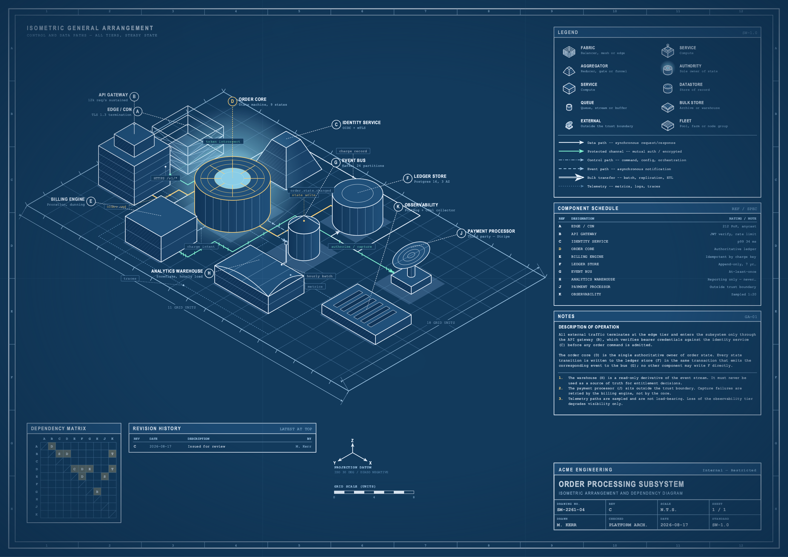

# isometric-blueprint

Draw any system as an isometric general-arrangement drawing on a vintage industrial
engineering blueprint sheet. One self-contained SVG per drawing; a print-size PDF on
request.

Works for software architecture, infrastructure, business process, and physical
plant. The component vocabulary is chosen by a component's *role* in the system, not
by what it literally looks like, which is why the same eleven forms cover a Kafka
cluster and a settling basin.



## What it produces

A single drawing sheet carrying:

- **Isometric massing** — components as varied 3D volumes on a ground grid, true
  30° projection, depth-sorted so nearer volumes occlude farther ones
- **Routed conduits** — dependencies as orthogonal service runs with half a unit of
  clearance from every foundation, labelled with what travels down them
- **Drafting furniture** — legend, component schedule keyed by reference letter,
  dependency matrix, revision history, notes panel, title block, sheet zone
  markings, datum dimension lines, projection rose
- **Reprographic finish** — paper grain, ink bleed, fold creases, foxing, vignette

Four skins, same layout in each: `diazo` (white on Prussian blue), `sepia` (aged
manila), `cyanotype` (navy on faded cyan, best for printing on white), `stark` (dark
film with amber and ice-blue trace).

## Installing

**Claude Code / Cowork**

```
/plugin install isometric-blueprint
```

**Cursor**

Clone or add this repo as a submodule, then symlink (or copy) the Cursor paths
into your project:

```bash
ln -s path/to/isometric-blueprint/.cursor-plugin .cursor-plugin
ln -s path/to/isometric-blueprint/.cursor .cursor
ln -s path/to/isometric-blueprint/skills skills
```

Or install globally so it is available in every project:

```bash
cp -r path/to/isometric-blueprint/skills/blueprint-system-map ~/.cursor/skills/
```

The plugin needs no connectors and no credentials.

## Using it

Ask in plain language:

> draw our payments stack as an isometric blueprint — traffic comes in through
> Cloudflare, then Kong, Kong checks tokens against Keycloak…

Or use the command:

```
/system-map our order pipeline: gateway, order service, postgres, kafka, warehouse
/system-map ./services            # infers topology from the repo
/system-map                       # asks what you want drawn
```

## Requirements

- Python 3.8 or later. No third-party packages for SVG output.
- `cairosvg` only for PDF output and for the internal visual check:
  `pip install cairosvg`. `rsvg-convert` or `inkscape` also work as PDF backends.

## Repository layout

```
.claude-plugin/plugin.json          Claude Code plugin manifest
.cursor-plugin/plugin.json          Cursor plugin manifest
.cursor/rules/system-map.mdc        Cursor rule (agent-requested)
commands/system-map.md              the /system-map command (Claude Code)
skills/blueprint-system-map/
  SKILL.md                          workflow, form and path vocabulary
  references/spec-schema.md         every spec field, plus a non-software example
  references/skins.md               the four skins and when each is right
  references/drafting-conventions.md sheet furniture, projection maths, extending
  scripts/render_blueprint.py       sheet assembly and annotation placement
  scripts/geometry.py               isometric projection and the form library
  scripts/router.py                 orthogonal conduit router
  scripts/skins.py                  palettes
  scripts/svg_to_pdf.py             print-size PDF export
  assets/example-spec.json          complete 10-component worked example
evals/evals.json                    test prompts and 14 assertions
```

## Rendering directly, without Claude

The renderer is an ordinary script. You can drive it from a spec file:

```bash
python3 skills/blueprint-system-map/scripts/render_blueprint.py \
  skills/blueprint-system-map/assets/example-spec.json \
  -o sheet.svg --skin sepia --pdf sheet.pdf
```

Output is deterministic: the same spec always produces byte-identical SVG, because
the paper aging is seeded from a hash of the title rather than the clock. This
matters for review — a diff shows what you changed, not what the RNG changed.

## Extending it

Adding a component form takes three steps and is documented in
`references/drafting-conventions.md`: write the form function in `geometry.py`,
register it in `FORMS` and `FORM_NOTES`, and add a row to the table in `SKILL.md`.
The last step matters most — an unregistered form is one nobody will ever choose.

Adding a skin is a single dictionary entry in `skins.py`. Two constraints:
`face_top` must be lighter than `face_right`, which must be lighter than
`face_left` (the light is upper-right; invert this and volumes read as holes), and
`ink_faint` must stay legible against `paper`, because it carries the ground grid
and every telemetry path.

## Known limits

- **Above about eighteen components** the annotation crowds and the dependency
  matrix stops being readable. Consolidate into subsystems instead.
- **An isometric plot always lands at roughly 1.73:1** on the sheet, whatever the
  proportions of the underlying grid, because screen width and height are both
  proportional to `x_extent + y_extent`. You cannot make it squarer by transposing
  the layout. The lower schedule strip exists to use the band this leaves over.
- **cairosvg ignores SVG filters.** Check renders lose the grain, mottle and ink
  bleed; browsers, Figma and PDF export all apply them correctly. Judge composition
  from a raster, never finish.

## Contributing

Changes to the renderer should keep the sheet deterministic. Before opening an MR,
render the example spec in all four skins and eyeball the results:

```bash
for s in diazo sepia cyanotype stark; do
  python3 skills/blueprint-system-map/scripts/render_blueprint.py \
    skills/blueprint-system-map/assets/example-spec.json -o "/tmp/$s.svg" --skin "$s"
done
```

`evals/evals.json` holds three end-to-end prompts and the fourteen assertions used
to benchmark the skill. Note that only three of those assertions discriminated in
the first benchmark — isometric projection, aged finish, and the presence of a
letter-keyed schedule. Treat the rest as regression guards rather than signal.

## Licence

MIT. See `LICENSE`.
